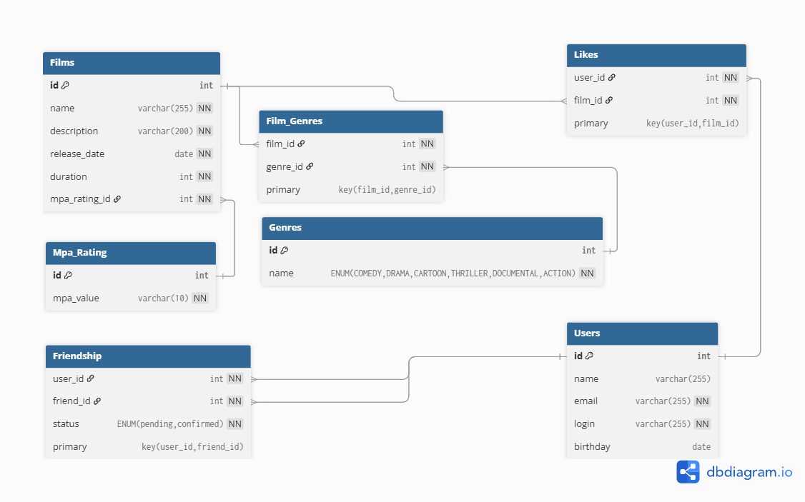

# java-filmorate
# Диаграмма базы данных

### Пояснение к схеме
**Film** - таблица предназначенная для хранения информации о фильмах, со следующими полями:
-`id` - уникальный индентификатор фильма
-`name` - название фильма
-`description` - описание фильма
-`release_date` - дата релиза фильма 
-`duration` - продолжительность фильма
-`mpa_rating` - возврастной рейтинг фильма(G, PG, PG-13, R, NC-17) 
**User** - таблица предназначенная для хранения информации о фильмах, со следующими полями:
-`id` - уникальный индентификатор пользователя
-`name` - имя пользователя
-`email` - электронная почта пользователя
-`login` - логин пользователя 
-`birthday` - дата рождения пользователя
**Film_Genre** - таблица с жанрами фильмов, cлужит для связи таблиц: Film и Genre
**Likes** - таблица хранящяя лайки, служит для связи таблиц: User и Film
**Friendship** - таблица отвечающая за дружбу пользователей
-`status` - статус дружбы(подтвержден/ожидающий)

## Примеры запросов к API:
### Пользователи:
POST /users - Добавление пользователя
{
    "id": 31,
    "email": "Karley85@yahoo.com",
    "login": "lrEX80Kmx9",
    "name": "Mr. Drew Anderson",
    "birthday": "1995-11-18",
    "friends": []
}
PUT /users - Обновление пользовтеля
{
"id": 5,
  "name": "Иван Иванон",
  "email": "ivan.ivanov@yandex.ru",
  "birthday": "1995-05-05"
  }
### Фильмы:
POST /films - Добавление фильма
{
  "name": "nisi eiusmod",
  "description": "adipisicing",
  "releaseDate": "1967-03-25",
  "duration": 100
}
PUT /films - Обновление данных о фильме
{
  "name": "nisi eiusmod",
  "description": "new description",
  "releaseDate": "202-02-11",
  "duration": 120
}
